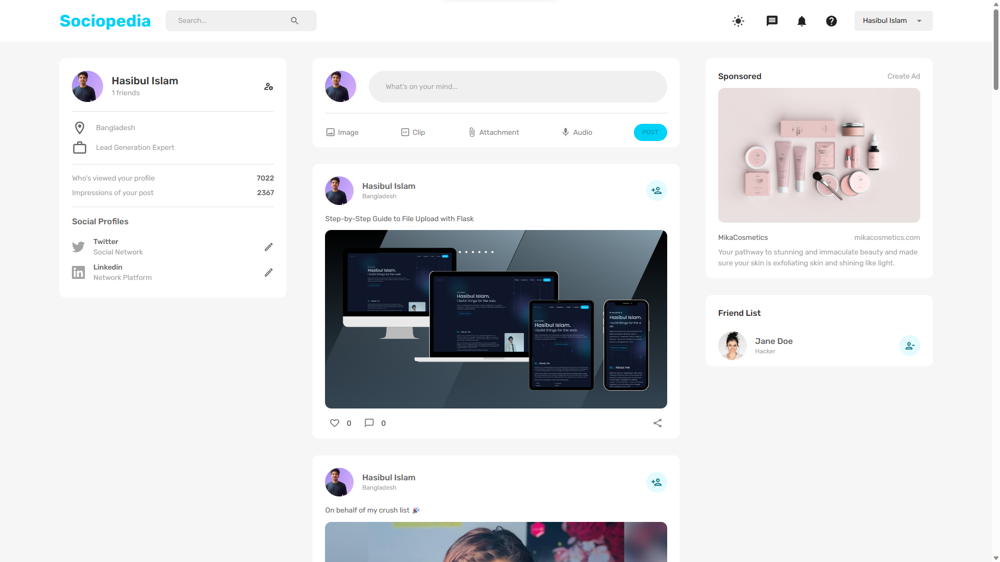

# Sociopedia Clone

> Build a COMPLETE Fullstack Responsive MERN App with Auth, Likes, Dark Mode | React, MongoDB, MUI

# Banner Image


## Clone Repo:

```bash
git clone https://github.com/developer-hasibulislam/sociopedia-clone.git
cd sociopedia-clone
npm i
npm fund
npm audit
npm i -f
npm audit fix
npm audit fix -f
```

## Environment Setup

```
PORT=
JWT_SECRET=
MONGO_URL=
```

### Important Links:

- Client Side - [Click Here](https://ls-link-shortener.vercel.app)
- Server Side - [Click Here](https://ls-link-shortener.onrender.com)

# Author

> Expert Full Stack Developer || Lead Generation Expert

- Hasibul Islam
  - `Linkedin` [hasibulislam999](https://www.linkedin.com/in/hasibulislam999)
  - `Twitter` [hasibulislam999](https://twitter.com/hasibulislam999)
  - `WhatsApp` [+8801906315901](https://wa.me/01906315901)
